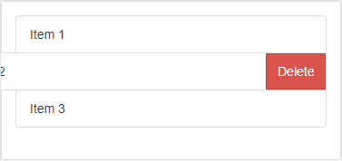
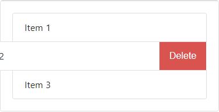

# ng2-bootstrap-list-swipe

## Description

A directive that adds swipe left / delete button behavior to the standard Bootstrap list-group-item.

[Bootstrap 3](http://getbootstrap.com/components/#list-group):



[Bootstrap 4](https://v4-alpha.getbootstrap.com/components/list-group/#basic-example):



## Requirements

Bootstrap 3:
```bash
$ npm install bootstrap@3 --save
```

OR Bootstrap 4:
```bash
$ npm install bootstrap@^4.0.0-alpha.6 --save
```

## Angular CLI Config
```json
"styles": [
  "../node_modules/bootstrap/dist/css/bootstrap.min.css",
  "../node_modules/ng2-bootstrap-list-swipe/styles.css",
  "styles.css"
],
```

## Installation

To install this library, run:

```bash
$ npm install ng2-bootstrap-list-swipe --save
```
and then from your Angular `AppModule`:

```typescript
import { SwipeModule } from 'ng2-bootstrap-list-swipe';

@NgModule({
  ...
  imports: [
    ...
    SwipeModule.forRoot()
  ],
  ...
})
export class AppModule { }
```

## Template

Bootstrap 3:
```xml
<div class="list-group">
    <div bs3-list-swipe-item *ngFor="let item of items; let i = index" (deleteCallback)="deleteItem(i)">{{ item.name }}</div>
</div>
```

OR Bootstrap 4:
```xml
<div class="list-group">
    <div bs4-list-swipe-item *ngFor="let item of items; let i = index" (deleteCallback)="deleteItem(i)">{{ item.name }}</div>
</div>
```

## Development

To generate all `*.js`, `*.d.ts` and `*.metadata.json` files:

```bash
$ npm run build
```

To lint all `*.ts` files:

```bash
$ npm run lint
```

## License

MIT © [Paul Hofferkamp](mailto:phofferkamp@gmail.com)
